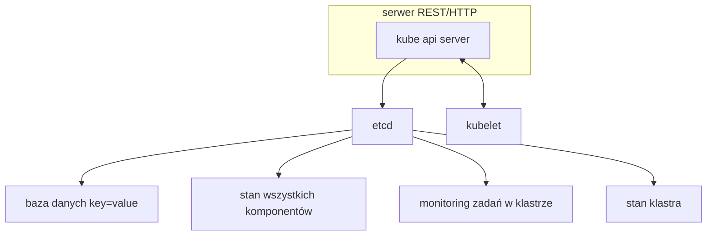

# k8s_understanding
zrozumienie architektury kubernetes

```mermaid
flowchart TD
A[kube api server] --> B[etcd]
A <--> C[kubelet]
B --> D[baza danych key=value]
B --> E[stan wszystkich komponentów]
B --> F[monitoring zadań w klastrze]
B --> G[stan klastra]
subgraph serwer REST/HTTP
A
end
```
