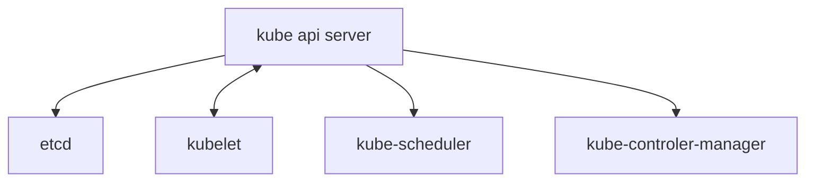
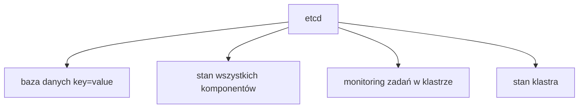
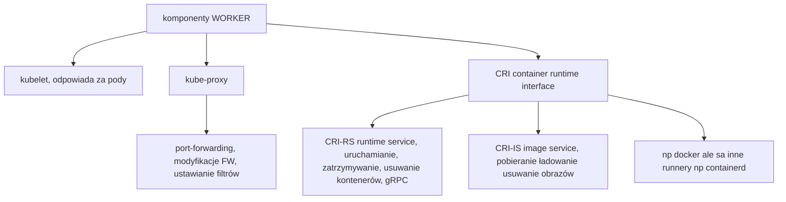
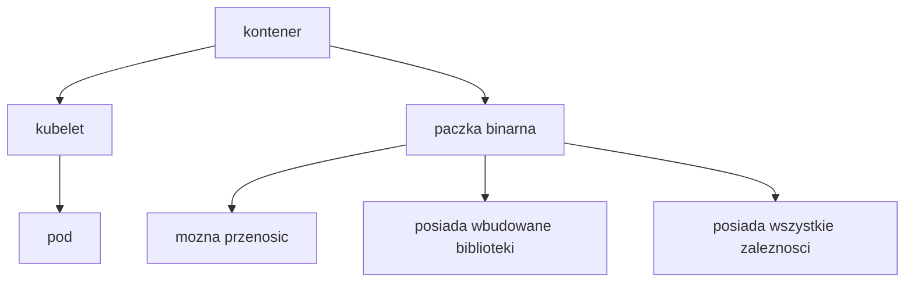
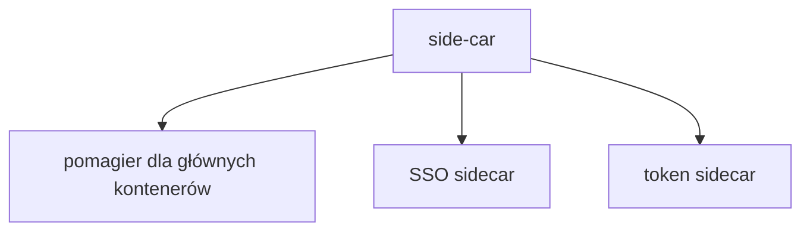

# k8s_understanding
zrozumienie architektury kubernetes



```mermaid
H[kube-scheduler] --> I[warstwa zarzadzajaca]
H --> J[lokowanie podów do nodów]
H --> K[matrix metryk skomplikowany system decyzyjny]
```
```mermaid
K[matrix metryk skomplikowany system decyzyjny] --> L[dostepnosc zasobów]
K --> M[wymagania aplikacji]
K --> N[manualne reguły mngmt]
K --> O[koszt]
```
```mermaid
P --> R[mngmt grupa wbudowana w klaster]
P --> S[ns,rs,sa,svc node endpoint token job cronjob controllers]
P --> U[ns] --> W[logiczna izolacja obiektow na grupy]
P --> T[mozna dodac wlasne np ingress na L7 secret controler]
```
```mermaid
U --> WA[default nie korzystamy]
U --> WB[kube-system rzadko sie edytuje]
U --> WC[kube-node-lease czas asocjacji z obiektem, leasing time]
U --> WD[kube-public dostepne dla wszystkich]
```
subgraph serwer REST/HTTP
A
end
```



