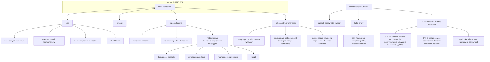

# k8s_understanding
zrozumienie architektury kubernetes

```mermaid
flowchart TD
A[kube api server] --> B[etcd]
A <--> C[kubelet]
B --> D[baza danych key=value]
B --> E[stan wszystkich komponentów]
B --> F[monitoring zadań w klastrze]
B --> G[stan klastra]
A --> H[kube-scheduler]
H --> I[warstwa zarzadzajaca]
H --> J[lokowanie podów do nodów]
H --> K[matrix metryk skomplikowany system decyzyjny]
K --> L[dostepnosc zasobów]
K --> M[wymagania aplikacji]
K --> N[manualne reguły mngmt]
K --> O[koszt]
A --> P[kube-controler-manager]
P --> R[mngmt grupa wbudowana w klaster]
P --> S[ns,rs,sa,svc node endpoint token job cronjob controllers]
P --> T[mozna dodac wlasne np ingress na L7 secret controler]
subgraph serwer REST/HTTP
A
end
AA[komponenty WORKER] --> AB[kubelet, odpowiada za pody]
AA --> AC[kube-proxy]
AC --> AD[port-forwarding, modyfikacje FW, ustawianie filtrów]
AA --> AE[CRI container runtime interface] --> AF[CRI-RS runtime service, uruchamianie, zatrzymywanie, usuwanie kontenerów, gRPC]
AE --> AG[CRI-IS image service, pobieranie ładowanie usuwanie obrazów]
AE --> AH[np docker ale sa inne runnery np containerd] 
```
